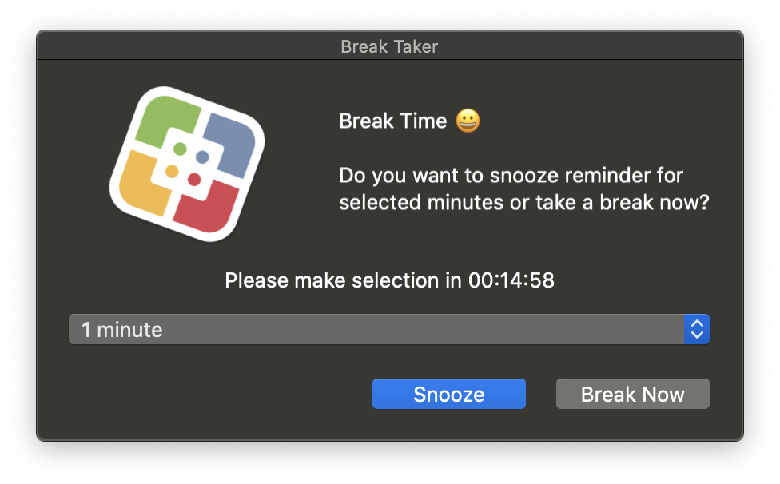
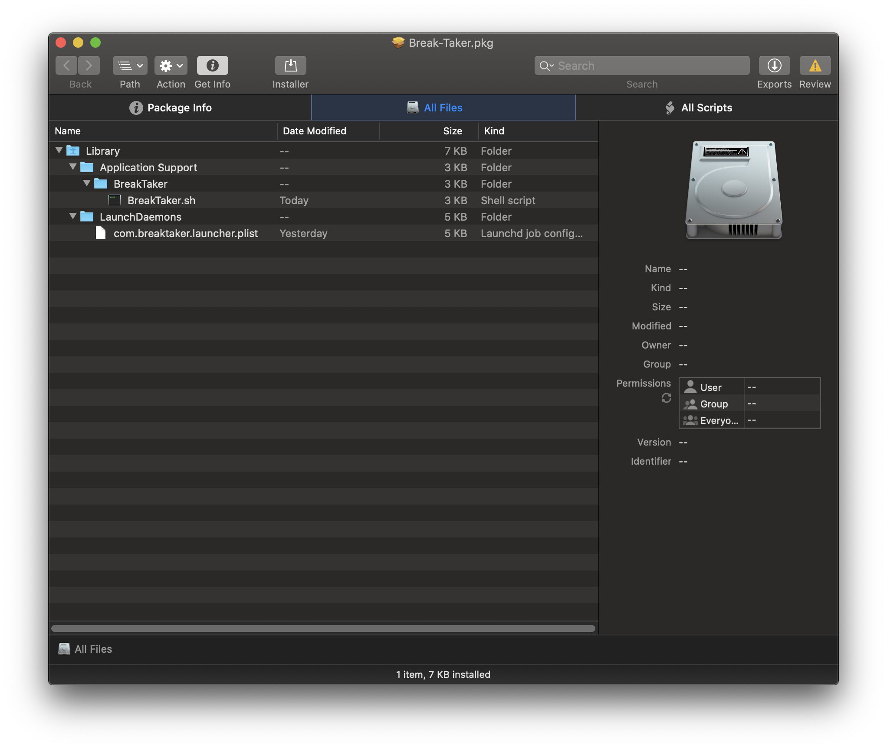
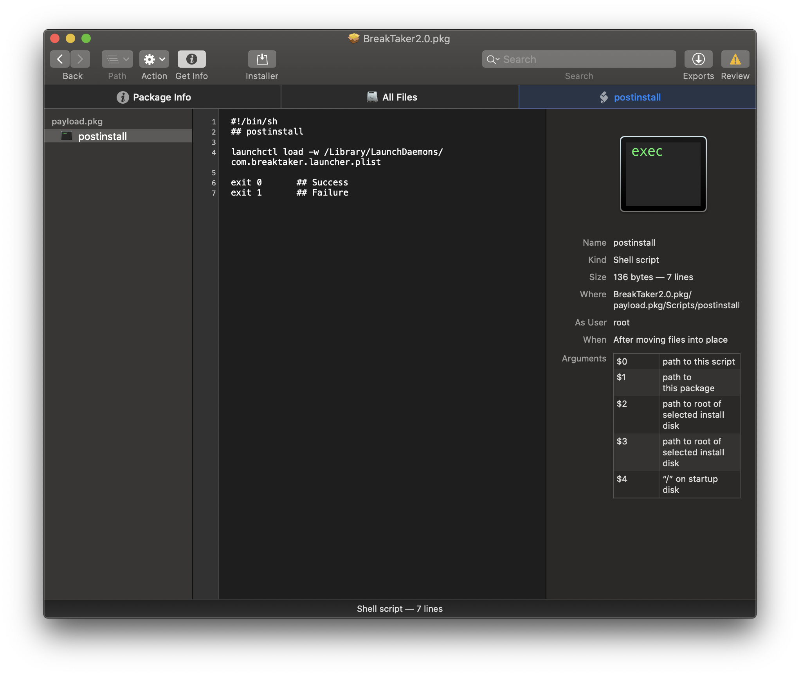

# Break Taker

*A jamfHelper tool that reminds you to take a break every two hours with the increase of WFH because of beer flu*

*What does it install you ask?*
---

*What does it really install?*
---

It installs a LaunchDaemon called `com.breaktaker.launcher.plist`, a script at `/Library/Application\ Support/BreakTaker/BreakTaker.sh` and a log fie at `/var/tmp/breaktaker.log`

*See the uninstall.sh script in this project to uninstall*

*Requirements*
---
- Machine with jamf binary installed

*Personal Suggestions*
---
- If you are a person who gives a lot of presentations, this might not be the best tool as it shows no mercy whether you're presenting or not.
- If you want to configure the time to be different, the LaunchDaemon plist will need to be edited by you.
